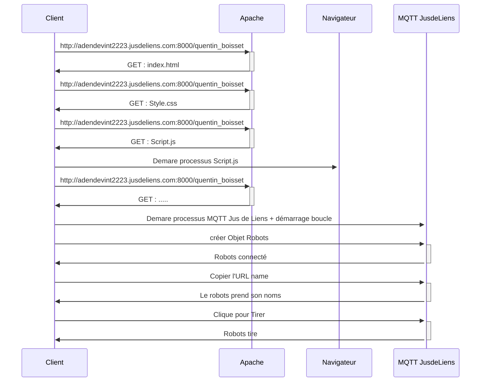

# iframebattlefx-Advanced Wars

## User Stories :
Définition : L'user Stories est une description simple d’un besoin ou d’une attente exprimée par un utilisateur.

### En tant que utilisateur, je veux :
- créer un site web Dynamique qui permettra de contrôler le robots soient de maniére auto ou mannuel ;
- Adapter le site internet pour tout type d'écrants (PC - Mobille - Tablette);
- Avoir la vue en mode supervision, et pas dans le mode arène;

- L'utilisateur doit pouvoir sélectionner 2 modes de comportements (Automatique ou en mode Mannuel) :

- - Mode Manuel : le robot ne fait que suivre les instructions données par des actions de
l’utilisateur sur des inputs de la page ;
- - Mode Automatique : le robot exécute un script sans besoin d’intervention de
l’utilisateur.

### Personeae Administrateur :

- Récupérer le nom du robot via paramètre GET dans url;
- le robots doit se connecter automatiquement à l’arène grâce à un code JS;
- le robots doit avoir la vue de dessus avec 4 orientations possibles : nord, sud, est, ouest;
- le robots ne doit pasdépasser la taille d’une case dans la grille de l’arène pour éviter les problémes;
- La taille doit s’adapter automatiquement à la taille de l’arène;
- L’affichage varie selon votre thème et son état en temps réel : sa vie, ses
munitions, sa position, ses ennemis autour de lui…;

### Diagramme Mermaid :

### Informations complémentaires :
Vous pourez retrouvez l'avancements du projet sur le Trello : https://trello.com/b/4AAijPFo/iframebattlex-quentin-boisset-advance-wars ;

Pour voir le modéle graphique de la page web, vous pouvez regarder le projet sur figma : https://www.figma.com/file/Fptpks2GM60yrwBlsZX4li/IFrameBattleX-Quentin-BOISSET-Advance-Wars?node-id=0%3A1&t=3FoYYZAXHVAhSg16-0 ;

Pour activer la musique, activer ce liens : https://jusdeliens.com/play/pyiotx-viewer/ 